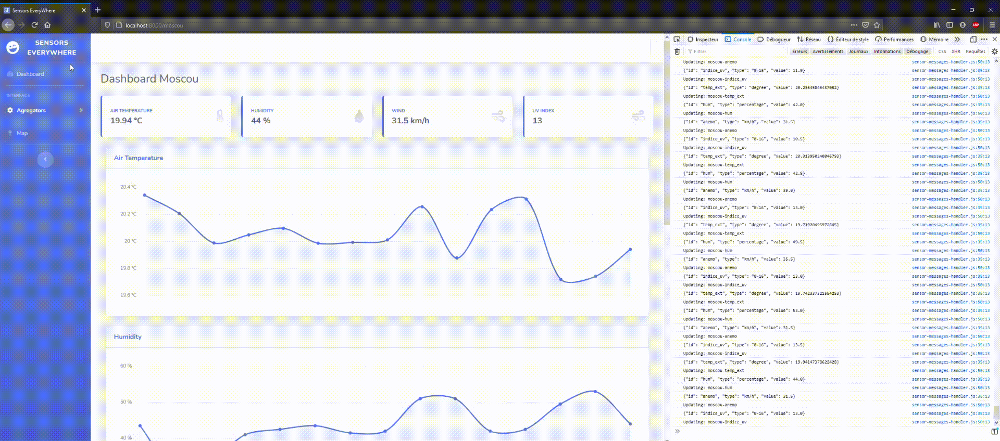

# Sensors EveryWhere 🚀

Web server based dashboard to view in real time the values of simulated sensors around the world.

# How to run the project

## Dependencies 🛠

- Make sure you have Rust installed in nightly:

`curl --proto '=https' --tlsv1.2 https://sh.rustup.rs -sSf | sh` or download the Windows installer.

`rustup default nightly`

- Mosquitto and MQTT library:
 
`sudo apt-get install mosquitto`
 
 If Mosquitto doesn't automatically launch, start it with: `systemctl start mosquitto`. You can check its status with: `systemctl status mosquitto`.
 
`pip3 install paho-mqtt`

- Required Python libraries:

`pip3 install numpy`

## Run the server ✅

`cd dashboard-web`

`cargo run`

You can now open `localhost:8000` in your browser and you should have access to the dashboard!

## Run all sensors and agregators ✅

Run all simulated local sensors with: `./start_all_sensors.sh`.

Run all agregators with (gnome): `./start_all_agregators.sh`. You can also run the agregators one by one in agregator/.

The python sensors scripts are executed in background, you can stop them with: `sudo killall python3`.
